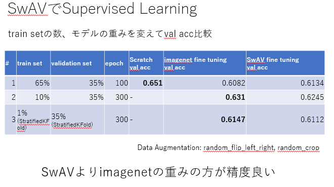
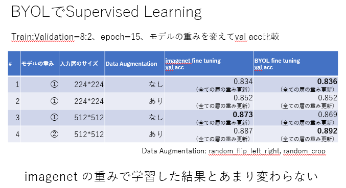

# Self-Supervised Learning試す

データはkaggleのキャッサバコンペ

https://www.kaggle.com/c/cassava-leaf-disease-classification

 

## SwAV 
https://arxiv.org/abs/2006.09882

- 埋め込みベクトルにクラスタリングを適応したSelf-Supervised Learning

#### Backborn Model
- ResNet50

#### Self-Supervised Training

- https://www.kaggle.com/anonamename/swav-tf

#### Supervised Training

- 実行環境: windows10, poetry (tensorflow 2.3.1 etc: [pyproject.toml](env/tfgpu/pyproject.toml))

- imagenetの重みで学習: [no-swav-resnet50-v2_local.ipynb](SwAV/no-swav-resnet50-v2_local.ipynb)

- SwAVの重みで学習: [swav-tf-linear-evaluation_local.ipynb](SwAV/swav-tf-linear-evaluation_local.ipynb)

   

## BYOL
https://arxiv.org/abs/2006.07733

- Negative sampleが不要なSelf-Supervised Learning

#### Backborn Model
- SeResNeXT50_32x4d

#### Self-Supervised Training

- 実行環境: windows10, anaconda (pytorch- lightning 1.11.0 etc: [lightning.yml](env/lightning.yml))

- ①画像サイズ224*224: [byol-pytorch_seresnext50_32x4d.ipynb](BYOL/byol-pytorch_seresnext50_32x4d.ipynb)
- ➁画像サイズ512*512: [byol-pytorch_seresnext50_32x4d_512.ipynb](BYOL/byol-pytorch_seresnext50_32x4d_512.ipynb)

#### Supervised Training

- 実行環境: windows10, anaconda ([lightning.yml](env/lightning.yml))
- ①のモデル+画像サイズ224*224: [byol-pytorch_seresnext50_32x4d_Supervised_Training_224.ipynb](BYOL/byol-pytorch_seresnext50_32x4d_Supervised_Training_224.ipynb)
- ①のモデル+画像サイズ224*224 + Data Augmentationあり: [byol-pytorch_seresnext50_32x4d_Supervised_Training_224_aug.ipynb](BYOL/byol-pytorch_seresnext50_32x4d_Supervised_Training_224_aug.ipynb)
- ①のモデル+画像サイズ512*512: [byol-pytorch_seresnext50_32x4d_Supervised_Training_512.ipynb](BYOL/byol-pytorch_seresnext50_32x4d_Supervised_Training_512.ipynb)
- ➁のモデル+画像サイズ512*512: [Supervised_Training_512_aug_byol-pytorch_seresnext50_32x4d_512.ipynb](BYOL/Supervised_Training_512_aug_byol-pytorch_seresnext50_32x4d_512.ipynb)

 

